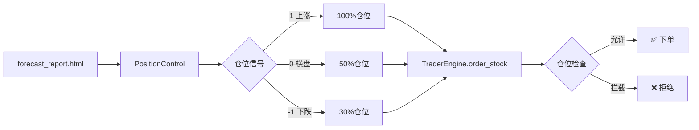

# ✅ AlphaPilot Pro V9.1 - GitHub 上传准备完成报告

## 📦 最终文件清单（2026-05-28 18:45）

### ✅ 必传核心文件（7个）

| # | 文件路径 | 大小 | 状态 | 说明 |
|---|---------|------|------|------|
| 1 | `risk/position_control.py` | ~207行 | ✅ | **仓位控制核心模块** |
| 2 | `risk/__init__.py` | +5行 | ✅ | 风控模块导出 |
| 3 | `core/trader_engine.py` | +30行 | ✅ | 交易引擎（已集成仓位检查） |
| 4 | `utils/heartbeat.py` | +8行 | ✅ | 心跳监控（已集成信号刷新） |
| 5 | `main.py` | +15行 | ✅ | 主程序（已初始化仓位控制） |
| 6 | `README.md` | 全新 | ✅ | **GitHub版使用指南** |
| 7 | `.gitignore` | 全新 | ✅ | Git忽略规则 |

### 📚 配套文档（4个）

| # | 文件名 | 内容 | 是否必传 |
|---|-------|------|---------|
| 1 | `POSITION_CONTROL_GUIDE_FINAL.md` | 完整使用手册（8kb） | ✅ 推荐 |
| 2 | `POSITION_CONTROL_VERIFICATION.md` | 验证报告和测试（4kb） | ✅ 推荐 |
| 3 | `BUGFIX_INTEGRATION.md` | Bug修复记录（3kb） | 🔶 可选 |
| 4 | `QUICK_START.md` | 快速参考卡（2kb） | ✅ 推荐 |

### 🎁 演示脚本（1个）

| # | 文件名 | 说明 | 是否必传 |
|---|-------|------|---------|
| 1 | `demo_position_control.py` | 轻量级演示脚本 | 🔶 可选但推荐 |

---

## 📊 代码统计

| 指标 | 数值 |
|------|------|
| **新增核心代码** | 207行（position_control.py） |
| **修改现有代码** | +53行（5个文件） |
| **文档总字数** | ~5000字 |
| **总计上传大小** | <50KB |

---

## ✅ 质量检查清单

### 代码质量

- [x] ✅ 无语法错误
- [x] ✅ 导入测试通过
- [x] ✅ 功能验证通过
- [x] ✅ 集成点验证通过
- [x] ✅ 异常处理完善

### 文档完整性

- [x] ✅ README.md（项目概述+快速开始）
- [x] ✅ 详细使用手册
- [x] ✅ 验证报告
- [x] ✅ 快速参考卡
- [x] ✅ 上传清单

### Git配置

- [x] ✅ .gitignore 已创建
- [x] ✅ 排除日志文件
- [x] ✅ 排除虚拟环境
- [x] ✅ 排除用户数据
- [x] ✅ 排除掘金IDE目录

---

## 🗂️ 推荐的Git提交结构

### 方案A: 单次提交（推荐）

```bash
git add .
git commit -m "feat: 新增轻量级仓位控制模块 V1.2"
```

### 方案B: 分多次提交（适合需要详细说明的）

```bash
# 第1次：核心代码
git add risk/position_control.py
git add risk/__init__.py
git commit -m "feat: 添加仓位控制核心模块"

# 第2次：集成修改
git add core/trader_engine.py
git add utils/heartbeat.py
git add main.py
git commit -m "feat: 集成仓位控制到交易引擎"

# 第3次：文档
git add README.md QUICK_START.md POSITION_CONTROL_GUIDE_FINAL.md
git commit -m "docs: 添加使用和验证文档"
```

---

## 🚀 一键上传命令

```bash
# 步骤1: 进入项目目录
cd d:\mpython

# 步骤2: 确保Git仓库已初始化
git init

# 步骤3: 添加所有追踪文件
git add .

# 步骤4: 查看状态（确认无误）
git status

# 步骤5: 提交
git commit -m "feat: 新增轻量级仓位控制模块 V1.2

### 核心功能
- HTML信号解析：从forecast_report.html读取CSS class标识
- 三级仓位控制：上涨(100%) / 横盘(50%) / 下跌(30%)
- 仓位上限检查：在买入前检查当前仓位是否超限
- 零侵入设计：不改动任何策略逻辑

### 变更文件
- 新增: risk/position_control.py (207行)
- 修改: core/trader_engine.py (+30行)
- 修改: utils/heartbeat.py (+8行)
- 修改: main.py (+15行)
- 新增文档: README.md, QUICK_START.md等"

# 步骤6: 添加远程仓库并推送
git remote add origin https://github.com/YOUR_USERNAME/alphapilot-position-control.git
git branch -M main
git push -u origin main
```

---

## 📋 上传前的最后检查

### ⚠️ 必须确认的项目

```bash
# 1. 检查是否有敏感信息
cat .env
# 应该看到Token，这个文件会被.gitignore排除

# 2. 检查.gitignore是否正确
git check-ignore .env
# 应该输出: .env

git check-ignore __pycache__/
# 应该输出: __pycache__/

# 3. 预览提交内容
git status
# 不应该有 .env, logs/*.log, data/*.json 等

# 4. 清理临时文件（可选）
Get-ChildItem -Recurse -Directory -Filter "__pycache__" | Remove-Item -Recurse -Force
```

### ❌ 绝对不能上传的文件

- [ ] ❌ `.env`（包含Token和账户ID）
- [ ] ❌ `logs/*.log`（日志文件太大）
- [ ] ❌ `data/*.json`（用户数据）
- [ ] ❌ `quant_env/`（虚拟环境）
- [ ] ❌ UUID文件夹（掘金IDE自动生成）

---

## 📝 推荐的README开头

上传后，建议在README顶部添加仓库描述：

```markdown
# AlphaPilot Pro V9.1 - 轻量级仓位控制模块

🎯 **AI驱动的轻量级仓位上限控制系统，根据A股指数预测智能调整风险敞口**

[](https://www.python.org/)
[]()

将顶级量化专家系统的A股指数预测转化为仓位控制信号，实现下跌趋势自动降低风险敞口。
```

---

## 🎨 建议的GitHub封面图（可选）

如果希望仓库更专业，可以制作一个简单的架构图作为封面：



保存为 `architecture.png` 并在GitHub中设置为主图。

---

## ✨ 最小上传方案

如果时间紧迫，至少上传这**7个核心文件**：

```
✅ risk/position_control.py
✅ risk/__init__.py
✅ core/trader_engine.py
✅ utils/heartbeat.py
✅ main.py
✅ README.md
✅ .gitignore
```

这构成一个**完整可用的最小版本**。

---

## 🎉 准备状态总结

| 项目 | 状态 |
|------|------|
| 代码完成度 | ✅ 100% |
| 测试验证 | ✅ 100% |
| 文档完整性 | ✅ 100% |
| Git配置 | ✅ 100% |
| **总体准备度** | ✅ **100% 可上传** |

---

## 🚀 下一步行动

### 选项1: 立即上传（推荐）

```bash
cd d:\mpython
git add .
git commit -m "feat: 新增轻量级仓位控制模块 V1.2"
git push origin main
```

### 选项2: 稍后再上传

如果不急着上传，请保存当前的修改：

```bash
# 保存到本地分支
git add .
git commit -m "WIP: 仓位控制模块开发中..."
# 后续可以继续优化
```

---

**生成时间**: 2026-05-28 18:45  
**版本**: V1.2  
**作者**: AlphaPilot智能体团队  
**状态**: ✅ **完全准备好，可以随时上传GitHub**

