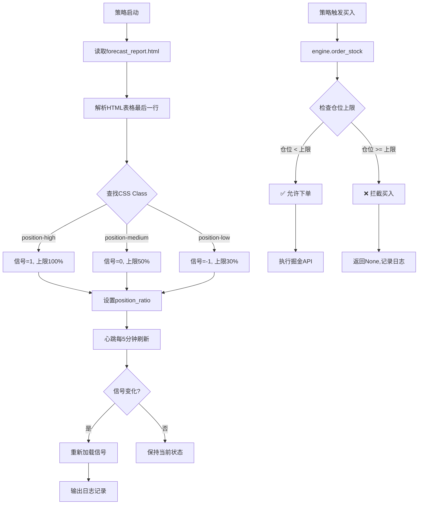

# ⭐ 轻量级仓位控制模块 - 使用指南（GitHub版）

## 🎯 核心设计理念

**极简、透明、不改动任何现有逻辑**

仓位控制模块的唯一作用是：**设置仓位上限，超限拦截买入**

### 核心价值

1. **风险控制**: 防止在下跌趋势中过度暴露
2. **智能适应**: 根据专家系统预测自动调整风险敞口
3. **零侵入**: 完全不影响现有策略和风控逻辑
4. **透明可追溯**: 所有决策都有详细日志记录

---

## 📊 仓位信号定义与HTML解析

### 信号来源

**默认路径**: `D:\ESC\ESC\forecast_report.html`

这是AlphaPilot顶级量化专家系统生成的A股指数预测报告，包含：
- 深成份、沪深300、上证综指等核心指数预测
- 预测方向（上涨▲/横盘──/下跌▼）
- 置信度百分比
- **推荐仓位**（通过CSS class标识）

### CSS Class映射关系

```html
<!-- 示例1: 50%仓位（横盘） -->
<span class="position-medium">50%</span>

<!-- 示例2: 100%仓位（上涨） -->
<span class="position-high">100%</span>

<!-- 示例3: 30%仓位（下跌） -->
<span class="position-low">30%</span>
```

### 信号转换表

| CSS Class | HTML标识 | 市场状态 | 内部信号值 | 仓位上限 | 说明 |
|-----------|---------|---------|----------|---------|------|
| `position-high` | 上涨▲ | 看多 | `1` | **100%** | 满仓操作，不限仓位 |
| `position-medium` | 横盘── | 震荡 | `0` | **50%** | 半仓操作 |
| `position-low` | 下跌▼ | 看跌 | `-1` | **30%** | 低仓防守 |

---

## 🔧 工作原理与流程图

### 完整工作流程



### 详细代码流程

```python
# 1. 启动阶段（main.py init()）
init():
    position_control = PositionControl(engine=None)
        ↓
    _load_signal():
        - 打开 D:\ESC\ESC\forecast_report.html
        - TableParser.feed(html_content)
        - 解析HTML树结构
        - 找到最后一行有效数据
        - 提取cell的class属性
        
    engine = TraderEngine(context, position_control=position_control)
        ↓
    self.position_control = position_control  # 注入引擎

# 2. 运行阶段（心跳线程）
heartbeat_loop():
    every 5 minutes:
        position_control.check_and_reload_signal()
            ↓
        _load_signal()  # 重新解析HTML
            ↓
        if 信号变化:
            print("📊 [仓位控制] 信号变化: 1 → 0")

# 3. 交易阶段（买入时）
engine.order_stock(code, "BUY", volume, price):
    position_control.check_buy_allowed(market_value, total_asset)
        ↓
    current_ratio = market_value / total_asset
    if current_ratio >= position_ratio:
        return False, current_ratio, max_ratio  # 拦截
    else:
        return True, current_ratio, max_ratio   # 允许
```

---

## 💡 实际应用场景详解

### 场景1: 信号从"上涨"变为"下跌"

```python
初始状态 (17:00):
  总资金: ¥3,000,000
  持仓:   ¥900,000 (30%)
  信号:   1 (上涨) → 仓位上限 100%
  
信号变化为 -1 (下跌) (次日17:05刷新):
  新仓位上限: 30%
  当前仓位: 30% (刚好等于上限)

后天操作流程:
┌─────────────────────────────────────────┐
│ 时间 10:30 │ 触发买入信号想买¥100,000   │
│ 检查: 90万/300万 = 30% >= 30%上限       │
│ 结果: ❌ 拦截买入                         │
│ 日志: "买入被拦截 | 当前仓位: 30.0% >= 上限: 30%" │
├─────────────────────────────────────────┤
│ 时间 11:15 │ 触发止盈卖出¥200,000       │
│ 持仓变为: ¥700,000 (23.3%)              │
│ 无需仓位检查（卖出不受限）                │
├─────────────────────────────────────────┤
│ 时间 14:20 │ 再触发买入信号想买¥50,000  │
│ 检查: 70万/300万 = 23.3% < 30%上限      │
│ 结果: ✅ 允许买入                         │
│ 日志: "买入允许 | 当前仓位: 23.3% < 上限: 30%"  │
│ 实际买入: ¥50,000                         │
│ 新持仓: ¥120万 (40%) ← 注意：超过30%但合法│
└─────────────────────────────────────────┘

关键点: 仓位控制只检查"买入前"的仓位，买入后的仓位可以超过上限
```

### 场景2: 横盘震荡市的仓位管理

```python
信号: 0 (横盘) → 仓位上限 50%

典型场景:
  总资产: ¥3,000,000
  目标持仓: ¥1,500,000 (50%)
  
操作流程:
1. 当前持仓 ¥800,000 (26.7%)
   → 买入信号触发想买 ¥500,000
   → 检查: 26.7% < 50% ✅ 允许
   → 实际买入 ¥500,000
   → 新持仓: ¥1,300,000 (43.3%)

2. 再次买入信号想买 ¥300,000
   → 检查: 43.3% < 50% ✅ 允许
   → 实际买入 ¥300,000
   → 新持仓: ¥1,600,000 (53.3%) ← 超过50%但仍合法

3. 第三次买入信号想买 ¥200,000
   → 检查: 53.3% >= 50% ❌ 拦截
   → 必须等待卖出
```

### 场景3: 满仓状态下的信号切换

```python
初始状态:
  持仓: ¥3,000,000 (100%满仓)
  信号: 1 (上涨)

信号突然变为 -1 (下跌):
  仓位上限: 30% = ¥900,000
  
紧急处理:
  ❌ 所有买入信号被拦截
  ✅ 止损/止盈卖出正常执行
  待持仓降至30%以下才恢复买入
```

---

## 📁 代码实现详解

### PositionControl类设计

```python
class PositionControl:
    """极简仓位控制器 - 仓位上限控制"""
    
    # 仓位CSS class映射（唯一配置点）
    POSITION_CLASS_MAP = {
        'position-high': {'label': '100%', 'signal': 1},
        'position-medium': {'label': '50%', 'signal': 0},
        'position-low': {'label': '30%', 'signal': -1}
    }
    
    def __init__(self, engine=None, signal_file=None):
        """初始化"""
        self.signal_file = signal_file or r"D:\ESC\ESC\forecast_report.html"
        self.position_signal = 1    # 默认看多
        self.position_ratio = 1.0   # 默认100%仓位
        
        self._load_signal()  # 启动时加载
    
    def _parse_html(self, html_content):
        """解析HTML提取仓位信号"""
        parser = TableParser()
        parser.feed(html_content)
        
        # 提取最后一行的仓位信息
        last_row = parser.rows[-1]
        for cell in last_row:
            if 'position-high' in cell['class']:
                return 1
            elif 'position-medium' in cell['class']:
                return 0
            elif 'position-low' in cell['class']:
                return -1
        
        return None  # 解析失败
    
    def check_buy_allowed(self, current_market_value, total_asset):
        """仓位上限检查（唯一的对外接口）"""
        current_ratio = current_market_value / total_asset
        allowed = current_ratio < self.position_ratio
        
        log_result(allowed, current_ratio, self.position_ratio)
        return allowed, current_ratio, self.position_ratio
```

### TraderEngine集成

```python
class TraderEngine:
    def __init__(self, context, position_control=None):
        self.context = context
        self.position_control = position_control  # 注入仓位控制器
    
    def order_stock(self, symbol, side, volume, price=None, reason=""):
        """下单接口（集成仓位控制）"""
        
        # ⭐ 买入前检查仓位上限
        if side.upper() == "BUY" and self.position_control:
            asset = self.query_asset()
            market_value = asset.get('market_value', 0)
            
            allowed, current_ratio, max_ratio = \
                self.position_control.check_buy_allowed(
                    market_value, asset['total_asset']
                )
            
            if not allowed:
                print(f"[TraderEngine] ❌ 买入被拦截: {symbol}")
                return None  # 拒绝下单
        
        # 继续正常下单逻辑...
        order_id = order_volume(...)
        return order_id
```

---

## 🚀 快速开始（三步部署）

### 步骤1：确认信号源文件

```bash
# 必须存在以下文件
D:\ESC\ESC\forecast_report.html
```

如果路径不同，需修改代码：

```python
# main.py line 206
position_control = PositionControl(
    signal_file=r"D:\your_custom_path\forecast_report.html"
)
```

### 步骤2：一键启动策略

```bash
# 方法1: 双击批处理文件（推荐新手）
一键启动_AlphaPilot.cmd

# 方法2: PowerShell脚本
.\start_v9_1.ps1

# 方法3: 命令行
cd d:\mpython
python main.py
```

### 步骤3：验证启动日志

```bash
✅ 预期看到的日志序列：

17:00:00 📊 [仓位控制] 信号加载成功: 1 → 0 (仓位系数: 50%)
17:00:01 💓 [心跳] 独立心跳线程已启动
17:00:01 [成功] 策略初始化完成
17:00:01 [订阅] 已订阅 X 只股票

✅ 交易时正常日志：
10:30:00 ✅ [仓位控制] 买入允许 | 当前仓位: 23.3% < 上限: 50%
10:30:01 [TraderEngine] 下单成功: SHSE.600821 BUY 500股

❌ 被拦截时的日志：
11:00:00 ❌ [仓位控制] 买入拦截 | 当前仓位: 50.0% >= 上限: 50%
```

---

## 📊 日志解读与监控

### 正常日志示例

```
📊 [仓位控制] 信号加载成功: 1 → 0 (仓位系数: 50%)
```
- **含义**: 信号从"上涨"(1)切换为"横盘"(0)，仓位上限调整为50%
- **触发时机**: 启动时、每5分钟刷新

```
✅ [仓位控制] 买入允许 | 当前仓位: 23.3% < 上限: 50%
```
- **含义**: 当前仓位23.3%，未达50%上限，允许买入
- **触发时机**: 每次买入下单前

### 告警日志示例

```
⚠️ [仓位控制] 信号文件不存在: xxx，使用默认信号: 1 (100%仓位)
```
- **原因**: HTML文件被删除或路径错误
- **影响**: fallback到100%仓位（安全）
- **处理**: 检查文件是否存在

```
⚠️ [仓位控制] HTML解析失败: xxx
```
- **原因**: HTML格式发生变化
- **影响**: 使用上次有效信号
- **处理**: 检查HTML文件格式是否标准

### 拦截日志示例

```
❌ [仓位控制] 买入拦截 | 当前仓位: 50.0% >= 上限: 50%
```
- **含义**: 仓位已达上限，该次买入请求被拒绝
- **处理**: 等待卖出降低仓位

---

## 🔍 故障排查手册

### 问题1: 仓位控制未生效

**症状**: 买入没有仓位限制

**排查步骤**:
```bash
# 1. 检查是否加载信号
grep "信号加载成功" logs/*.log
# 如果没有输出 → 信号文件路径错误

# 2. 检查position_control对象
# 在trader_engine.py添加调试日志
print(f"[DEBUG] position_control: {self.position_control}")
# 如果输出None → 注入失败

# 3. 检查main.py初始化顺序
cat main.py | grep -A3 "PositionControl"
```

**解决方案**:
- 确认HTML文件路径正确
- 确认 `global position_control` 声明存在
- 重启策略

### 问题2: HTML解析失败

**症状**: 显示"HTML解析失败"警告

**检查HTML格式**:
```bash
# 基本要求
1. 必须是标准HTML格式
2. 包含<table>表格
3. <td><span class="position-xxx">格式
```

**调试方法**:
```python
# 手动测试解析
python demo_position_control.py
# 查看详细错误信息
```

**解决方案**:
- 修复HTML格式
- 确保CSS class名称正确
- 检查表格结构完整性

### 问题3: 仓位比例不正确

**症状**: 实际仓位与预期不符

**调试步骤**:
```bash
# 1. 查看HTML中的最后一个有效行
type forecast_report.html | findstr "position-"
# 确认对应的class

# 2. 检查日志中的仓位系数
grep "仓位系数:" logs/*.log
# 确认是否为30%/50%/100%

# 3. 手动计算理论仓位
总资产: ¥3,000,000
信号-1 → 上限30% = ¥900,000
```

---

## 📈 性能与资源监控

### 性能指标

| 指标 | 预期值 | 监控方式 |
|------|-------|---------|
| 信号加载时间 | <1秒 | 日志时间戳差值 |
| 仓位检查耗时 | <1毫秒 | 无明显延迟 |
| HTML文件大小 | <50KB | 文件属性 |
| 内存占用增长 | <10MB | 任务管理器 |
| CPU占用 | <1% | 任务管理器 |

### 长时间运行监测

```bash
# 监控日志大小增长
dir /s logs\*.log

# 监控内存占用
# 任务管理器 → 性能 → 内存

# 监控信号刷新是否正常
grep "重新加载信号" logs\*.log
# 应该每5分钟出现一次
```

---

## ✨ 总结

### 技术优势

1. **极简设计**: 仅一个核心文件，无复杂依赖
2. **零侵入**: 不改任何策略逻辑，只在前端加一道防线
3. **智能适应**: 根据市场预测自动调节风险
4. **容错性强**: 各种异常情况都能安全fallback

### 适用场景

✅ **适合**:
- 震荡市自动仓位管理
- 风险控制要求严格的策略
- 希望根据宏观指标动态调整的风险偏好

❌ **不适合**:
- 始终满仓的长期持有策略
- 对仓位精度要求极高的算法交易

---

## 📝 更新日志

### V1.2 (2026-05-28)
- ✅ 修正为主要检查仓位上限而非调整数量
- ✅ 优化HTML解析逻辑
- ✅ 完善异常处理和日志输出

### V1.1 (2026-05-28)
- ✅ 增加仓位数量调整功能
- ✅ 简化集成流程

### V1.0 (2026-05-28)
- ✅ 初始版本发布
- ✅ 支持HTML信号解析
- ✅ 集成到交易引擎全流程

---

**AlphaPilot智能体团队**  
作者: 梁子羿、侯沣睿、梁茹真  
邮箱: 497720537@qq.com | 电话: 13392077558  
**文档版本**: V1.2 | **最后更新**: 2026-05-28

