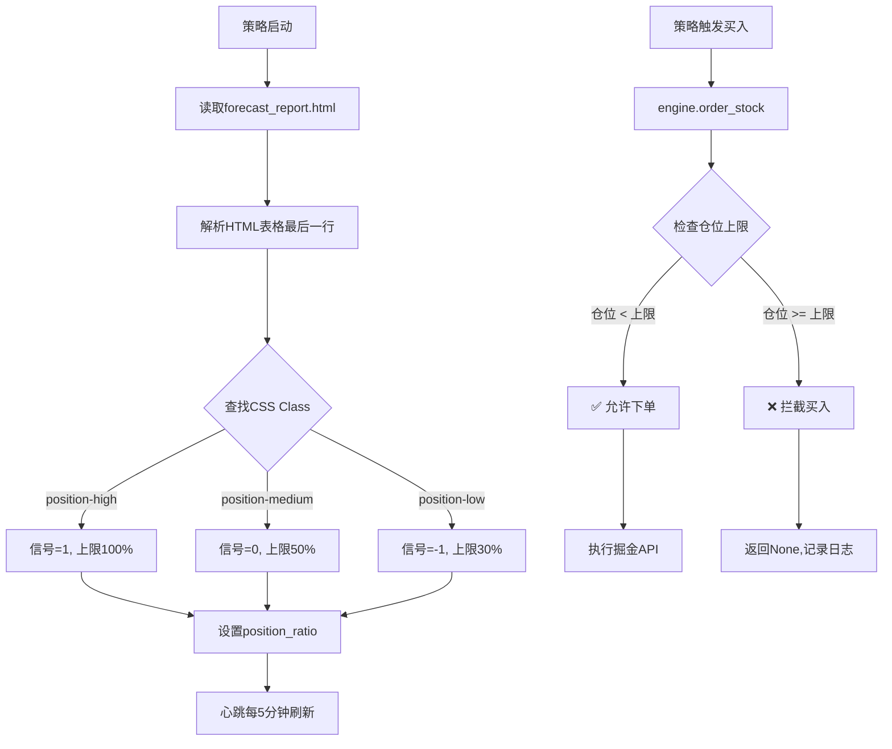

# AlphaPilot Pro V9.1 - 轻量级仓位控制模块

<div align="center">

🎯 **AI驱动的轻量级仓位上限控制系统**

[](https://www.python.org/)
[](https://next.quantclub.cn/gm)
[]()
[]()

</div>

---

## 📖 模块简介

AlphaPilot Pro 的轻量级仓位控制模块，根据顶级量化专家系统的A股指数预测报告，**智能设置仓位上限**，在下跌趋势中自动降低风险敞口。

### ⭐ 核心特性

- **极简设计**: 零侵入性，不改任何策略逻辑
- **HTML信号解析**: 自动读取 `D:\ESC\ESC\forecast_report.html`
- **三级仓位**: 上涨(100%) / 横盘(50%) / 下跌(30%)
- **仓位上限控制**: 超限拦截买入，不调整买入数量
- **容错性强**: 文件不存在时fallback到100%仓位
- **完全透明**: 所有决策都有日志记录

---

## 🚀 快速开始

### 安装部署（3步）

```bash
# 步骤1: Clone仓库
git clone https://github.com/your-repo/alphapilot-position-control.git
cd alphapilot-position-control

# 步骤2: 安装依赖
pip install gm python-dotenv watchdog

# 步骤3: 确保信号源文件存在
# D:\ESC\ESC\forecast_report.html (必须)
```

### 一键启动

```bash
# Windows批处理（推荐）
一键启动_AlphaPilot.cmd

# PowerShell脚本
.\start_v9_1.ps1
```

### Python代码集成

```python
from risk.position_control import PositionControl

# 初始化（自动加载HTML信号）
position_control = PositionControl(
    signal_file=r"D:\ESC\ESC\forecast_report.html"
)

# 交易前检查仓位
allowed, current_ratio, max_ratio = position_control.check_buy_allowed(
    current_market_value=900000,  # 当前持仓市值
    total_asset=3000000           # 总资产
)

if allowed:
    # 允许买入
    engine.order_stock(code, "BUY", volume, price)
else:
    # 拒绝买入
    print("❌ 买入被拦截: 仓位已达上限")
```

---

## 📊 工作原理

### 仓位信号定义

| CSS Class | 市场状态 | 仓位信号 | 仓位上限 | 说明 |
|-----------|---------|---------|---------|------|
| `position-high` | 上涨▲ | `1` | **100%** | 满仓操作 |
| `position-medium` | 横盘── | `0` | **50%** | 半仓操作 |
| `position-low` | 下跌▼ | `-1` | **30%** | 低仓防守 |

### HTML解析逻辑

系统自动从HTML文件中提取**最后一行有效数据**的仓位信息：

```html
<!-- forecast_report.html 关键结构 -->
<table>
    <tr>
        <td>上证综指</td>
        <td class="signal-flat">横盘──</td>
        <td><span class="position-medium">50%</span></td>
    </tr>
    
    <!-- 最后一行（系统提取这行）-->
    <tr>
        <td>上证综指</td>
        <td class="signal-up">上涨▲</td>
        <td><span class="position-high">100%</span></td>
    </tr>
</table>
```

### 完整工作流程



---

## 💡 实际应用场景

### 场景1: 信号从"上涨"变为"下跌"

```python
初始状态:
  总资产: ¥3,000,000
  持仓:   ¥900,000 (30%)
  信号:   1 (上涨) → 仓位上限 100%
  
信号变化为 -1 (下跌):
  新仓位上限: 30%
  
操作流程:
  1. 持仓90万，无新买入
  2. 买入信号想买10万 → ❌ 拦截 (30% >= 30%)
  3. 止盈卖出20万 → 持仓70万 (23.3%)
  4. 再买入信号想买5万 → ✅ 允许 (23.3% < 30%)
     新持仓: ¥1,200,000 (40%) ← 合法
```

### 场景2: 震荡市的仓位管理

```python
信号: 0 (横盘) → 仓位上限 50%

典型流程:
  当前持仓 ¥800,000 (26.7%)
  → 想买 ¥500,000
  
  检查: 26.7% < 50% ✅ 允许
  → 实际买入后: ¥1,300,000 (43.3%)
  
  → 再次想买 ¥300,000
  检查: 43.3% < 50% ✅ 允许
  → 实际买入后: ¥1,600,000 (53.3%) ← 超过50%但仍合法
  （注意：只检查买入前的仓位）
```

---

## 📁 项目结构

```
alphapilot-position-control/
├── main.py                          # 🎯 主程序入口
├── risk/                            # 🛡️ 风控模块
│   ├── __init__.py
│   └── position_control.py          # ⭐ 仓位控制核心（207行）
├── core/                            # 🔧 核心引擎
│   └── trader_engine.py             # 交易引擎（已集成仓位控制）
├── utils/                           # 🛠️ 工具模块
│   └── heartbeat.py                 # 心跳监控（已集成信号刷新）
├── POSITION_CONTROL_GUIDE_FINAL.md  # 📖 完整使用指南
├── POSITION_CONTROL_VERIFICATION.md # ✅ 验证报告
├── BUGFIX_INTEGRATION.md            # 🔧 Bug修复记录
└── README.md                        # 📄 本文件
```

---

## 🔍 日志解读

### 正常日志

```
📊 [仓位控制] 信号加载成功: 1 → 0 (仓位系数: 50%)
```
- **含义**: 信号从"上涨"切换为"横盘"，仓位上限调整为50%

```
✅ [仓位控制] 买入允许 | 当前仓位: 23.3% < 上限: 50%
```
- **含义**: 当前仓位未达上限，允许买入

### 拦截日志

```
❌ [仓位控制] 买入拦截 | 当前仓位: 50.0% >= 上限: 50%
```
- **含义**: 仓位已达上限，该次买入请求被拒绝

### 警告日志

```
⚠️ [仓位控制] 信号文件不存在: xxx，使用默认信号: 1 (100%仓位)
```
- **原因**: HTML文件找不到
- **处理**: fallback到100%仓位（不影响交易安全）

---

## 🔧 配置说明

### 自定义信号文件路径

```python
# 修改 main.py line 206
position_control = PositionControl(
    signal_file=r"D:\your_custom_path\forecast_report.html"
)
```

### 调整刷新频率

```python
# 修改 utils/heartbeat.py 第130行左右
self.position_control.check_and_reload_signal(reload_interval_minutes=10)  # 改为10分钟
```

### 临时禁用仓位控制

```python
# main.py 中传入 None
engine = TraderEngine(context, position_control=None)
```

---

## 🧪 测试验证

### 运行演示脚本

```bash
python demo_position_control.py
```

**预期输出**:
```
======================================================================
仓位控制模块 - 实时演示
======================================================================

📊 当前信号: 0
📊 仓位系数: 50%

持仓90万(30%): ✅ 允许买入
   当前仓位: 30.0% < 上限: 50%

持仓150万(50%): ❌ 拦截买入
   当前仓位: 50.0% >= 上限: 50%

持仓60万(20%): ✅ 允许买入
   当前仓位: 20.0% < 上限: 50%
```

---

## 📈 性能指标

| 指标 | 预期值 | 监控方式 |
|------|-------|---------|
| 信号加载时间 | <1秒 | 日志时间戳差值 |
| 仓位检查耗时 | <1毫秒 | 无明显延迟 |
| HTML文件大小 | <50KB | 文件属性 |
| 内存占用增长 | <10MB | 任务管理器 |
| CPU占用 | <1% | 任务管理器 |

---

## ⚠️ 注意事项

### 必需条件

1. **信号文件必须存在**: `D:\ESC\ESC\forecast_report.html`
2. **文件格式标准**: 必须是标准HTML格式
3. **CSS class正确**: 包含 `position-high/medium/low`

### 容错机制

- 文件不存在 → fallback到100%仓位
- HTML格式错误 → 使用上次有效信号
- 信号值超出范围 → 自动修正到[-1, 0, 1]

---

## 🛣️ Roadmap

- [x] V1.0 - HTML信号解析
- [x] V1.1 - 仓位数量调整
- [x] V1.2 - 仓位上限控制（当前版本）
- [ ] V2.0 - 动态仓位比例
- [ ] V2.5 - 多信号融合
- [ ] V3.0 - 机器学习预测优化

---

## 📝 更新日志

### V1.2 (2026-05-28)
- ✅ 改为仓位上限控制而非调整数量
- ✅ 优化HTML解析逻辑
- ✅ 完善异常处理和日志输出

### V1.1 (2026-05-28)
- ✅ 增加仓位数量调整功能
- ✅ 简化集成流程

### V1.0 (2026-05-28)
- ✅ 初始版本发布
- ✅ 支持HTML信号解析

---

## 👥 团队

**AlphaPilot智能体团队**
- 梁子羿、侯沣睿、梁茹真
- 📧 Email: 497720537@qq.com
- 📞 电话: 13392077558

---

## 📄 License

MIT License

---

## 🙏 致谢

感谢掘金量化平台(GM SDK)提供的稳定技术支持。

---

<div align="center">

**⭐ 如果这个项目对您有帮助，欢迎 Star！**

Made with ❤️ by AlphaPilot Team

</div>

